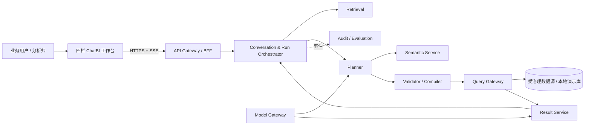

# InsightFlow ChatBI 系统架构

> 版本：v0.1（本地演示基线）  
> 来源：`ChatBI_Production_PRD_v1.0`、InsightFlow ChatBI UI 规范  
> 原则：本地演示不伪装成生产能力；生产边界从第一天保留，但先以模块化单体交付端到端可信闭环。

## 1. 架构决策摘要

项目从空仓启动，建议先落地一个 TypeScript workspace 中的“模块化单体 + 可替换适配器”，而不是立即部署 PRD 中的全部微服务。这样能最快完成可演示切片，同时保持领域边界、接口和事件可独立拆分。

- Web：当前本地演示采用 Vite 7、React 19、TypeScript、CSS design tokens、Tabler Icons、Recharts；引入服务端渲染或嵌入式交付时，再评估 Next.js 应用壳，领域与 API 契约不随壳变化。
- API：Fastify + TypeBox/OpenAPI；运行编排使用显式状态机，长任务通过 SSE 推送。
- 持久化：生产 PostgreSQL；本地使用 SQLite（Drizzle ORM 的相同领域模型）。
- 队列与缓存：生产 Redis + BullMQ；本地使用进程内队列与 TTL Map，通过接口注入替换。
- 检索：生产 PostgreSQL `pgvector` + 全文检索/可插拔 reranker；本地使用内存语义目录、关键词/同义词打分。
- 数据查询：生产经只读 Query Gateway 连接数仓；本地仅查询固定 mock dataset 或 DuckDB 演示库。
- LLM：统一 `ModelGateway`；本地默认确定性规则规划器，可选通过环境变量启用真实模型。模型永远不持有数据源凭据。
- 契约：TypeBox/JSON Schema 为单一事实源，生成 OpenAPI 与前端类型；拒绝未知字段。
- 测试：Vitest、Testing Library、Playwright；契约与状态迁移测试优先于页面快照。

生产演进时，模块按 PRD 边界拆为 Conversation、Retrieval、Planner、Semantic、Compiler、Query Gateway、Result、Evaluation、Audit 服务；API 和事件契约保持不变。

### 1.1 当前仓库落地状态

当前代码仍是单仓 Vite/TypeScript 项目，但已经形成四层边界：

| 层 | 当前目录 | 当前能力 | 后续演进 |
|---|---|---|---|
| UI | `src/App.tsx`、`src/features/*` | 工作台、数据源中心、语义中心、协作资产中心、运营中心；工作台通过本地 application service 驱动 | 切换为 API adapter，补组件测试与 E2E |
| Contracts | `packages/contracts/*`、`src/contracts/*` | `@insightflow/contracts` 已拥有独立 `api`、`domain`、`events`、`openapi`、`sdk` 源码，覆盖 `AnalysisIR v1`、`PublicRunView`、`ResultPageView`、API/error envelope、公共 DTO、审计事件、错误对象、错误码目录、SSE 事件、schema、OpenAPI 草案、开发者请求 helper、endpoint scope 映射和嵌入式 iframe 配置 helper；`src/contracts`/`src/api/openapi.ts` 仅作为旧相对 import 的兼容层 | 使用 TypeBox/JSON Schema 生成生产 OpenAPI 和 SDK，逐步让应用直接从包名 import |
| Application | `src/application/*` | deterministic `submitQuestion`、澄清、取消、Run 查询、幂等和边界检查；身份上下文与策略裁决；服务账号/API Key 签发/撤销/验签、Webhook 签名投递计划/重试/死信、Webhook delivery queue/http client 端口与本地 dispatcher、embed token 开发者接入治理；数据源列表/详情/连接测试；语义指标评审/认证；导出分享重新鉴权；评测门禁与失败回放；模型路由、配额、降级链、灰度回滚；SLO 报告与性能预算评估；协作资产列表、收藏、订阅门禁和审计；依赖 persistence 与本地 Query Gateway 端口 | 接检索、Planner、生产 Query Gateway adapter、真实 Model Gateway、外部身份/策略引擎、API Key 轮换/存储加固、真实 Webhook 队列/HTTP client adapter、语义对象持久化、真实导出文件生成、评测流水线、真实监控告警、数据源/协作资产持久化与通知调度 |
| Semantic | `src/semantic/*` | 本地 Semantic Catalog、认证指标/草稿指标、维度、兼容维度和 Join Graph 风险门禁；治理服务暴露提交评审、认证发布、参考 SQL 对账门禁和 public audit | 持久化版本仓库、Join Graph 编辑审批、参考 SQL 自动对账、血缘和灰度发布 |
| Query | `src/query/*` | Analysis IR 经 Semantic Catalog 校验后生成只读 SQL AST/SQL，注入权限守卫、SQL 指纹、缓存键和预算阻断 | 方言插件、EXPLAIN 成本模型、连接池、取消传播和真实结果分页 |
| Persistence | `src/persistence/*` | conversation、run、idempotency、audit events 端口、内存 adapter、本地 JSON 文件 adapter、SQL migration、versioned migration runner、可替换 SQL adapter、retention cleanup planner/executor；SQL 审计事件单独落表并提供 run/scope 索引；默认留存为问题/IR/SQL 指纹 180 天、结果摘要 30 天、原始结果 7 天、敏感样本 3 天、审计 365 天 | 接具体 SQLite/PostgreSQL/Redis driver、迁移执行 CLI、连接池、生产审计查询 API 和实际清理调度 |
| API App | `apps/api/*` | API 运行时配置、`/readyz`、header actor guard、memory/file persistence mode、Node adapter 组合入口 | 替换为 Fastify/TypeBox、OIDC/API key 中间件、生产 SSE 长连接 |
| BFF Adapter | `src/api/*` | 本地 HTTP router、contracts 包 OpenAPI 草案、SSE events endpoint、结果 cursor 分页 endpoint、身份策略 API、开发者接入 API、数据源 API、语义治理 API、导出分享 API、评测回放 API、模型运营 API、SLO/性能预算 API、协作资产 API、Node server adapter 源码、CORS/状态码映射测试 | 保持为框架无关 router 或拆入 `apps/api` |
| E2E | `tests/e2e/*` | Playwright + 本机 Chrome 覆盖标准查询、表格替代、口径证据、CSV 下载文件水印/策略/审计元数据、澄清、权限拒绝、运行中取消、部分结果显式提示、刷新后恢复、语义指标评审/认证、数据源降级质量门禁、受限字段样本策略、协作资产重新鉴权/水印/订阅阻断、运营回放和移动端面板可达 | 扩展 WebKit/Safari、XLSX/PDF/PNG 和异步大文件导出 |

`apps/api` 当前提供 API 应用壳：`/readyz`、运行时配置、生产式 header actor 校验、memory/file persistence mode，以及 Node adapter 组合入口。`src/api` router 支持 `/healthz`、`/openapi.json`、`/v1/identity` 身份上下文/策略裁决、`/v1/developer` 服务账号/API Key/Webhook/embed token、`POST /v1/questions`、`GET /v1/runs/{id}`、`GET /v1/results/{id}` cursor 分页结果、`GET /v1/runs/{id}/events`、`POST /v1/runs/{id}/clarify`、`POST /v1/runs/{id}/cancel`，以及 `/v1/data-sources` 数据源列表/详情/连接测试、`/v1/semantic` 语义指标评审/认证、`/v1/sharing` 导出/异步大文件任务/分享治理、`/v1/evaluation` 黄金集门禁/失败回放、`/v1/model-ops` 模型路由/决策/回滚、`/v1/operations/slo` SLO 报告/性能预算评估和 `/v1/assets` 协作资产列表/收藏/订阅/审计接口。它是生产 API 的契约基线，不是最终运行时；本地 JSON 文件 adapter 用于开发态跨进程/重启验收，`src/persistence/sql.ts` 提供 production-shaped DDL 和 SQL repository 端口，生产环境仍需 OIDC/API key 认证、具体数据库/缓存 driver、长连接生命周期管理、审计索引和网关部署。

共享契约包当前是 F11/API SDK 的源码切片：`packages/contracts` 暴露 `@insightflow/contracts` 包名和 `api`、`domain`、`events`、`openapi`、`sdk` 子路径，包内持有公共契约源码、OpenAPI 草案、开发者请求构造 helper、typed endpoint 请求 helper、endpoint scope 映射、嵌入式 iframe 配置/snippet helper 和数据库凭据扫描护栏，不再从 `src/contracts` 或 `src/domain` 反向 re-export。OpenAPI 草案已包含 `PublicApiError`、`ErrorEnvelope`、通用 `ApiEnvelope`、Run/Result envelope 和关键 Run/Result/Question 路径的统一 JSON/error response 引用；SDK helper 已覆盖问题提交、Run 读取、SSE、结果分页、导出创建和导出状态查询，`exports.status` 使用独立 `exports:read` 最小权限 scope；`src/contracts` 与 `src/api/openapi.ts` 只保留兼容层，服务旧的相对 import；包级测试锁定版本、schema、错误码、公共状态词表、SSE helper、SDK helper、错误包络和 OpenAPI 路径。下一阶段应把 OpenAPI 从草案升级为 schema 生成产物，并把手写 SDK 基线升级为代码生成和包发布流程。

开发者接入当前是 F11/F12 的服务治理切片：`DeveloperAccessApplicationService` 提供服务账号、API Key、Webhook 和短期 embed token 的本地契约。服务账号绑定当前工作区/业务域、scope、过期时间和日配额；API Key 只返回前缀、脱敏预览与 hash 指纹，可撤销、可轮换、可验签为 `service_account` actor，并校验 scope、过期时间、轮换宽限期、配额和 workspace/domain 边界；`apps/api` runtime 支持 `Authorization: Bearer ...`，验签通过后把 service-account actor 注入既有 BFF router；Webhook 强制 HTTPS、HMAC-SHA256 签名、300 秒重放保护、指数退避和死信策略，服务层可生成签名 headers、重放保护窗口、完整 queued 退避计划和死信结果，并声明不投递越权数据；`WebhookDeliveryDispatcher` 提供队列、HTTP client、死信视图和 payload redaction 的本地 deterministic 端口；embed token 由 Host 以自身权限换取，5–120 分钟有效，组件不能接触数据库凭据；`@insightflow/contracts/sdk` 提供最小开发者请求和 embed iframe helper。它尚未实现生成式 SDK、真实 Webhook 队列/HTTP client adapter 或独立 embed SDK 包发布。

身份策略当前是 F01 的服务治理切片：`IdentityPolicyApplicationService` 提供当前身份上下文、可见工作空间、角色、策略版本、权限摘要、策略裁决和策略更新。策略更新会提升 `policyVersion`，并让 `cacheKeyScope` 与 `permissionDigest` 变化，表达“5 分钟内生效、旧缓存不可绕过”的验收语义。它尚未接入真实 OIDC/SAML/SCIM、服务账号短期令牌、外部 Policy Engine 或生产审计表。

数据源中心当前是 F02 的前端 + 服务治理切片：用 fixture 表达只读连接、凭据引用、元数据目录、字段分类、样本策略、质量门禁和同步记录，并通过组件测试锁定筛选与连接测试反馈。`DataSourceApplicationService` 进一步把 actor 可见范围过滤、只读 credential ref、元数据详情、连接测试、质量门禁状态和受限字段样本策略接入 `/v1/data-sources` API，且 public view 不暴露真实凭据。它尚未接入真实连接器、扫描调度、血缘、枚举采样或 Schema 变更审批；这些能力应在后续 `DataSourceService` 与 `MetadataScanner` adapter 中落地。

协作资产中心当前是 F12 的前端 + 服务治理切片：用 fixture 表达会话资产、验证案例、问题模板和订阅，展示收藏、归档、分享范围、订阅频率、审核人、版本快照和审计事件，并通过组件测试锁定搜索、状态筛选、收藏反馈和审核中不可订阅规则。`CollaborationAssetApplicationService` 进一步把列表过滤、收藏更新、审核中/归档不可订阅、接收者重新鉴权摘要和 public audit event 接入 `/v1/assets` API。它尚未接入真实资产持久化、分享链接、通知发送、订阅调度或导出文件生成；这些能力应在后续 `CollaborationAssetService`、`ShareAuthorization` 与 `NotificationScheduler` adapter 中落地。

导出分享当前是 F08 的服务治理切片：`SharingExportApplicationService` 在导出前调用身份策略裁决，检查 100k 行/50MB 在线预算、受限分类阻断、脱敏规则、水印文本和短期下载链接预览；超过在线阈值的任务会返回 `queued`、异步队列名、状态 URL、预计就绪时间和 `requiresAuditApproval=true`，并可通过 `/v1/sharing/exports/{id}` 查询；工作台 CSV 下载会调用该服务并把水印、策略版本、权限摘要、脱敏规则和审计事件写入文件；分享只保存 run/asset 引用，不保存高权限结果快照，接收者打开时按自身身份重新鉴权。它尚未生成真实 XLSX/PDF/PNG 文件、生产对象存储结果、生产水印或异步 worker。

本地 Semantic Catalog 当前是 F03/F06 的交界切片：它按 tenant/workspace/domain/semanticVersion 解析认证指标、草稿指标、维度、兼容维度和 Join Edge；可信模式只允许 certified metric，高风险或未批准 Join Graph 路径会在 SQL 生成前拒绝。

语义治理当前是 F03 的服务治理切片：`SemanticGovernanceApplicationService` 以本地 catalog 为事实源，提供指标列表、详情、提交评审、认证发布、参考 SQL 对账门禁、角色权限、不可变版本和 Join Graph 风险暴露。认证后的指标才可进入可信模式；具体高风险 Join 仍在 Compiler 使用该维度时阻断。它尚未接入真实语义对象仓库、Join Graph 编辑器、参考 SQL 自动对账执行器、灰度发布或回滚。

本地 Query Gateway 当前是 F06 的安全边界切片：Compiler 只接受规范 Analysis IR 和 Semantic Catalog 裁决后的 metric/dimension ID，生成只读 SQL AST/SQL，并注入 tenant/workspace/business domain 守卫；Gateway 再次校验只读、多语句、预算、语义版本、SQL 指纹、权限摘要、数据版本和缓存键。`PublicRunView` 只返回 public-safe `QueryExecutionSummary`，不向业务用户暴露原始 SQL；`ResultPageView` 通过 `/v1/results/{id}` 在服务端复核租户/工作区边界后返回列、当前页行、`nextCursor`、`hasMore`、权限摘要和显式 `rawSqlExposed=false`/`rawDatabaseCredentialsExposed=false`。它尚未连接真实数仓、EXPLAIN、连接池、取消令牌、生产对象存储结果页或方言插件矩阵。

评测回放当前是 F09/F10 的服务治理切片：`EvaluationApplicationService` 使用运营中心 fixtures 形成可测试的黄金集门禁和失败回放契约。任一 P0 门禁低于目标时 `releaseAllowed=false`，阻断样本按角色过滤，回放计划显式声明需要脱敏且不能使用生产凭据。它尚未接入真实黄金集管理、批量回归队列、OpenTelemetry trace、灰度发布控制面或审计落库；这些能力应在后续 `EvaluationService`、`ReplayRunner` 与 `ReleaseGate` adapter 中落地。

模型运营当前是 F09 的服务治理切片：`ModelOpsApplicationService` 使用运营中心模型版本 fixture 形成可测试的路由控制面契约。每条路由包含能力、供应商、active/candidate 版本、灰度流量、超时、温度、租户训练/留存覆盖、租户/工作区日配额和降级链；路由决策按租户策略、配额、供应商可用性和发布门禁选择 active、candidate 或 fallback；回滚仅允许 `platform_ops` / `security_admin`，并将流量切回 active 100%。它尚未调用真实模型供应商、采集真实成本/延迟、写入生产模型审计或执行自动告警回滚；这些能力应在后续 `ModelGateway`、`ModelTelemetry` 与 `ReleaseController` adapter 中落地。

SLO 与性能预算当前是 F09 的运营控制面切片：`SloApplicationService` 复用运营中心 SLO、延迟、成本和回放 fixture，提供 `/v1/operations/slo` 报告与 `/v1/operations/slo/budget-evaluations` 单次 Run 预算决策。报告覆盖可用性、首个状态反馈 P95、完整答案 P95、单次成功成本、取消传播 P95、错误预算、告警 runbook 和审计事件；预算决策按延迟、成本、扫描量和可选取消传播时间返回 `allow/warn/block`，并在预警或阻断时生成 public-safe 审计。它尚未接入 Prometheus/OpenTelemetry、真实压测、线上告警投递或自动回滚阈值执行；这些能力应在后续 `TelemetryIngestor`、`SloEvaluator` 与 `AlertDispatcher` adapter 中落地。

## 2. 系统上下文与边界



不可越过的边界：

1. 浏览器不接触数据源、模型密钥或 SQL 执行凭据。
2. Planner 只输出版本化 Analysis IR，不能直接提交 SQL。
3. Semantic Service 裁决指标、维度与 Join Graph；Compiler 只接受规范 ID。
4. Query Gateway 只执行已验证的只读 AST，并再次注入租户/权限/预算。
5. Answer 只能引用查询结果单元格或已授权知识；completed run 会执行 groundedness 校验，确保确定性事实的结果引用存在且事实值与引用单元格一致；失败、空结果和部分结果不能被自然语言掩盖。

## 3. UI 信息架构与状态语义

### 3.1 四栏桌面结构

桌面端设计基准为 1440px，严格对齐 UI 规范：

| 区域 | 宽度 | 职责 | 数据来源 |
|---|---:|---|---|
| 全局导航 | 68px 固定 | 产品入口、工作台、语义/运营入口、个人菜单 | 静态路由 + 当前角色 |
| 会话列表 | 260px 固定 | 新建、搜索、会话历史、当前会话、最新消息/状态 | `ConversationSummary[]` |
| 主工作区 | 弹性，最小 720px | 问题、执行时间线、答案、图表、证据、底部追问输入 | `Message[]`、`RunView`、`ResultView` |
| 上下文面板 | 235px 固定 | 业务域、模式、指标口径、过滤、时间、来源、语义版本 | `ConversationState`、`Evidence` |

总宽不足 1280px 时，右侧上下文面板变为抽屉；不足 960px 时，会话列表也变为抽屉。主工作区不能低于可用阅读宽度。输入框固定在主工作区底部，答案永远与问题及执行过程位于同一时间线；首页不堆叠功能入口。

### 3.2 用户可见状态（唯一词表）

| UI 状态 | API `display_status` | 含义 | 允许操作 |
|---|---|---|---|
| 待输入 | `waiting_input` | 没有活动运行，等待用户问题 | 提交问题 |
| 理解中 | `understanding` | 检索、实体链接、计划生成或校验 | 停止 |
| 查询中 | `querying` | 编译、预算检查、数据执行或结果处理 | 停止 |
| 已完成 | `completed` | 可信结果和依据已就绪 | 追问、导出、反馈 |
| 需澄清 | `needs_clarification` | 关键歧义；未执行查询 | 选择候选、补充问题、取消 |
| 失败 | `failed` | 运行不能继续，且无可交付结果 | 重试、修改条件 |

内部状态可以更细，但必须映射到上述六种展示状态；`partial_result` 是结果完整性而非第七种任务状态，UI 在“已完成”卡片上使用警告标记并列出未完成步骤。取消后的运行回到“待输入”，历史消息保留“已取消”终止原因。

合法迁移：

```text
waiting_input -> understanding -> querying -> completed
                         |              |  -> completed(partial=true)
                         |              -> failed
                         -> needs_clarification -> understanding
                         -> failed
understanding/querying/needs_clarification -> cancelled -> waiting_input
```

规则：同一会话至多一个活动 Run；会话列表显示最近消息与最近 Run 状态；“停止”必须 3 秒内完成取消传播或明确提示仍在取消。

## 4. 模块化单体结构

建议目录：

```text
apps/
  web/                    # Vite + React 四栏工作台
  api/                    # Fastify HTTP/SSE 入口
packages/
  contracts/              # TypeBox schema、OpenAPI、事件、错误码
  domain/                 # 领域实体、状态机、策略，不依赖框架
  application/            # 用例与端口：SubmitQuestion、ClarifyRun、CancelRun
  adapters/
    persistence/          # SQLite/PostgreSQL
    planner/              # deterministic / LLM
    semantic/             # mock catalog / production catalog
    query/                # mock dataset / DuckDB / warehouse
    events/               # in-memory / Redis
  ui/                     # token、复用组件
fixtures/
  semantic/               # 演示指标、维度、同义词、Join Graph
  datasets/               # 演示结果数据，不含真实敏感数据
  scenarios/              # 问题 -> IR -> 结果/澄清/失败
```

依赖方向固定为 `web/api -> application -> domain`；adapters 实现 application 定义的端口。领域层不得依赖 Fastify、React、数据库 ORM 或模型 SDK。

## 5. 核心领域模型

所有聚合都携带 `tenantId`、`workspaceId`；外部返回的 ID 使用不透明 UUID/ULID。

### 5.1 聚合与值对象

- `Conversation`：`id`、`title`、`businessDomainId`、`mode`、`semanticVersion`、`state`、`activeRunId?`、`createdBy`、时间戳。
- `ConversationState`：当前 `metrics`、`dimensions`、`filters`、`timeRange`、`grain`、`orderLimit`、`presentation`、`assumptions`；用户显式约束带 `source=user`，系统默认不能覆盖它。
- `Message`：`role=user|assistant|system`、`content`、`runId?`、`resultRefs[]`、`createdAt`；自然语言历史不是执行事实源。
- `Run`：问题快照、模式、内部状态、展示状态、阶段、预算、IR、结果/澄清/错误、版本标签、取消令牌和审计关联。
- `Clarification`：`reasonCode`、`prompt`、1–3 个 `Candidate`、`irRevision`、过期时间；响应必须绑定候选版本。
- `SemanticMetric`：规范 ID、公式、聚合、粒度、单位、时间语义、所有者、生命周期和不可变版本。
- `SemanticDimension`：规范 ID、类型、层级、枚举/同义词、默认排序、兼容粒度。
- `JoinEdge`：左右实体、键、基数、方向、允许路径、风险标签。
- `AnalysisPlan`：通过 schema 校验的 IR 与确定性 `planFingerprint`。
- `QueryExecution`：SQL 指纹、方言、预算、权限摘要、数据版本、执行统计；对普通用户默认不返回原始 SQL。
- `ResultSet`：schema、分页 rows、统计、完整性、freshness、cell references、chart spec。
- `Evidence`：指标口径、过滤、时间、数据新鲜度、来源、语义版本、结果引用。
- `Feedback`：评价、原因标签、备注、可选正确答案，关联完整运行链路。
- `AuditEvent`：主体、代理、目的、策略/语义/模型版本、脱敏级别、trace/request ID。

### 5.2 模式隔离

`mode` 为 `trusted | exploration | expert`。MVP UI 默认且仅开放 `trusted`；即使未来开放，也禁止单个 Run 混用认证指标与临时计算。模式进入缓存键、审计、结果标签和分享授权。

## 6. Analysis IR v1 契约

IR 使用严格 JSON Schema（`additionalProperties: false`），服务端维护兼容版本白名单：

```json
{
  "schema_version": "1.0",
  "intent": "trend",
  "business_domain_id": "sales",
  "metrics": [{ "metric_id": "net_revenue", "operation": "value" }],
  "dimensions": [{ "dimension_id": "order_date", "grain": "month" }],
  "time_range": {
    "kind": "relative",
    "expression": "last_12_complete_months",
    "timezone": "Asia/Shanghai"
  },
  "filters": [{
    "dimension_id": "order_status",
    "operator": "in",
    "values": ["completed"]
  }],
  "order_limit": { "order_by": [{ "field_ref": "order_date", "direction": "asc" }], "limit": 1000 },
  "steps": [{
    "id": "step_1",
    "kind": "query",
    "depends_on": [],
    "budget": { "timeout_ms": 15000, "max_rows": 1000, "max_scan_bytes": 100000000 }
  }],
  "presentation": { "preferred_view": "line" },
  "assumptions": [{ "code": "WORKSPACE_TIMEZONE", "label": "按工作区时区统计", "value": "Asia/Shanghai" }]
}
```

关键校验顺序：Schema → 语义对象及版本 → 指标/维度粒度兼容 → Join Graph → 类型/成员值 → 权限 → 预算 → AST 白名单。任一阶段失败都不能提交数据源。

## 7. HTTP、SSE 与错误契约

所有 HTTP 响应带 `request_id`；请求头支持 `Idempotency-Key`。认证上下文来自服务端会话/令牌，客户端不得提交可信的 `tenant_id` 或权限摘要。

### 7.1 MVP API

| 方法 | 路径 | 用途 |
|---|---|---|
| `GET` | `/v1/bootstrap` | 当前用户、工作空间、业务域、模式能力和 UI 配置 |
| `GET/POST` | `/v1/conversations` | 列表/新建会话 |
| `GET/PATCH` | `/v1/conversations/{id}` | 获取、重命名、归档会话 |
| `GET` | `/v1/conversations/{id}/messages` | 游标分页时间线 |
| `POST` | `/v1/questions` | 提交问题，返回 `202` + Run |
| `GET` | `/v1/runs/{id}` | Run 快照，用于重连与兜底轮询 |
| `GET` | `/v1/runs/{id}/events` | SSE 增量事件；支持 `Last-Event-ID` |
| `POST` | `/v1/runs/{id}/clarify` | 提交候选 ID + `ir_revision` |
| `POST` | `/v1/runs/{id}/cancel` | 幂等取消并向执行器传播 |
| `GET` | `/v1/results/{id}` | 游标分页结果，服务端复核权限 |
| `POST` | `/v1/feedback` | 点赞/点踩与原因 |
| `GET` | `/v1/semantic/metrics/{id}` | 当前用户可见的指标口径与版本 |
| `POST` | `/v1/developer/service-accounts` | 创建绑定工作区、scope、配额和过期时间的服务账号 |
| `POST` | `/v1/developer/api-keys` | 为服务账号签发短期 API Key，只返回脱敏预览和 hash 指纹 |
| `POST` | `/v1/developer/api-keys/{id}/revoke` | 撤销 API Key |
| `POST` | `/v1/developer/api-keys/{id}/rotate` | 轮换 API Key；旧 key 在宽限期内可验签，宽限期后自动拒绝 |
| Runtime | `Authorization: Bearer <api-key>` | `apps/api` 将 API Key 验签为服务端可信 actor，校验 scope、配额、过期和工作区边界，再注入 BFF router |
| `POST` | `/v1/developer/webhooks` | 注册带签名、重放保护、退避和死信策略的 Webhook |
| `POST` | `/v1/developer/webhooks/{id}/test` | 发送 Webhook 测试事件 |
| `POST` | `/v1/developer/webhooks/{id}/deliveries` | 规划签名投递、重放保护、退避重试和死信结果；生产由异步队列与 HTTP client 执行 |
| `POST` | `/v1/developer/embed-tokens` | Host 换取短期嵌入 token，组件不能接触数据库凭据 |
| `GET` | `/v1/model-ops/routes` | 模型路由、版本、配额、超时、温度和降级链 |
| `POST` | `/v1/model-ops/route` | 按能力、配额、供应商可用性和门禁执行一次模型路由决策 |
| `POST` | `/v1/model-ops/routes/{id}/rollback` | 运维/安全管理员回滚候选版本灰度流量 |
| `GET` | `/v1/operations/slo` | 获取 SLO 目标、错误预算、告警 runbook 和审计事件 |
| `POST` | `/v1/operations/slo/budget-evaluations` | 按延迟、成本、扫描量和取消传播评估单次 Run 性能预算 |

`POST /v1/questions` 请求：

```json
{
  "conversation_id": "01J...",
  "question": "过去 12 个完整自然月净收入趋势",
  "business_domain_id": "sales",
  "mode": "trusted",
  "stream": true
}
```

`202` 响应：

```json
{
  "request_id": "req_...",
  "run": {
    "id": "run_...",
    "conversation_id": "01J...",
    "display_status": "understanding",
    "phase": "retrieving",
    "can_cancel": true,
    "created_at": "2026-06-22T09:00:00+08:00"
  },
  "events_url": "/v1/runs/run_.../events"
}
```

### 7.2 SSE 包络

```text
id: 42
event: run.phase_changed
data: {"event_version":"1.0","run_id":"run_...","sequence":42,"occurred_at":"...","display_status":"querying","phase":"executing"}
```

事件至少包括：`run.snapshot`、`run.phase_changed`、`clarification.required`、`result.delta`、`answer.completed`、`run.completed`、`run.failed`、`run.cancelled`。客户端只按 `sequence` 应用新事件；断线后携带 `Last-Event-ID` 重连，若事件已过期则先取 Run 快照。

### 7.3 统一错误

```json
{
  "request_id": "req_...",
  "error": {
    "code": "QUERY_TOO_EXPENSIVE",
    "message": "查询范围过大，请缩短时间或增加筛选。",
    "retryable": false,
    "details": { "suggested_actions": ["shorten_time_range", "add_filter"] }
  }
}
```

公开错误码采用 PRD 词表：`AMBIGUOUS_QUERY`、`SEMANTIC_NOT_FOUND`、`PERMISSION_DENIED`、`QUERY_TOO_EXPENSIVE`、`DATA_STALE`、`PARTIAL_RESULT`、`MODEL_UNAVAILABLE`，并补充 `RUN_ALREADY_ACTIVE`、`RUN_CANCELLED`、`VALIDATION_FAILED`、`INTERNAL_ERROR`。`PERMISSION_DENIED` 不返回资源是否存在、候选值或内部策略细节。

## 8. 本地 mock 策略

本地演示必须是可重复的“场景模拟”，不是在 UI 中散落 `setTimeout`。

### 8.1 Fixtures

- 业务域：销售分析。
- 认证指标：净收入、订单数、客单价；均带单位、公式、负责人、版本和新鲜度。
- 维度：日期、区域、城市、产品线、渠道、订单状态。
- 数据：12–18 个月匿名聚合数据，包含趋势、区域排名、空结果和局部异常。
- 问题场景：成功趋势、排行榜、多轮换维度、指标歧义、成员歧义、越权、超预算、空结果、部分结果、模型不可用、取消。

### 8.2 可替换端口

```ts
interface PlannerPort { plan(input: PlanningInput, signal: AbortSignal): Promise<PlanOutcome> }
interface SemanticPort { resolve(input: ResolveInput): Promise<SemanticContext> }
interface QueryPort { execute(input: SafeQuery, signal: AbortSignal): AsyncIterable<QueryEvent> }
interface EventBus { publish(event: DomainEvent): Promise<void>; subscribe(runId: string): AsyncIterable<DomainEvent> }
```

`SCENARIO_MODE=fixture` 时，确定性规划器按规范化问题/场景 ID 返回固定 IR；Query Adapter 查询 fixtures/DuckDB 并按配置延时发出阶段事件。测试可将延时设为 0。`SCENARIO_MODE=live` 才启用模型与真实只读数据适配器，并且需要显式密钥和安全配置。

### 8.3 演示真实性规则

- UI 中所有数字必须来自 fixture 查询结果，不能硬编码在答案组件。
- 状态由后端状态机产生，刷新后可恢复；不能只保存在 React state。
- 澄清选择会生成新的 IR revision，并继续同一个 Run 链路。
- 取消使用 `AbortController` 贯穿 Planner/Query Adapter；测试断言不再产生完成事件。
- 开发调试面板可切换场景，但生产构建不可见。

## 9. 安全、治理与可观测性

本地演示也保留这些接口级约束：

- 请求上下文：`subjectId`、`tenantId`、`workspaceId`、角色、属性、策略版本；服务端派生权限摘要。
- 每次检索、计划、查询、导出继承身份上下文；日志只记录 SQL 指纹和脱敏摘要。
- 缓存键：租户 + 用户权限摘要 + 模式 + 语义版本 + SQL 指纹 + 数据版本。
- 数据内容一律视为不可信输入，不得改变系统策略或触发工具调用。
- Trace：所有运行具有 `trace_id`、`request_id`、版本标签；领域事件可重放。
- 指标：成功率、澄清率、拒答率、阶段 P95、执行准确率、引用覆盖、取消传播耗时、缓存命中和单次成本。
- 审计失败时，敏感查询和导出 fail closed；普通演示请求可记录到本地受控缓冲。

生产适配建议：OpenTelemetry + Prometheus/Grafana + 结构化日志；策略使用 OPA/Cedar 类 Policy Engine；密钥来自 KMS/Vault；下载使用短期签名 URL 和水印。

## 10. 数据存储

MVP 最小表：

- `conversations`、`conversation_states`、`messages`
- `runs`、`run_events`、`clarifications`
- `result_sets`、`result_pages`（本地可 JSON；生产对象存储 + 元数据）
- `semantic_objects`、`semantic_versions`、`join_edges`
- `feedback`、`audit_events`

关键约束：Run 状态迁移使用乐观锁 `version`；`run_events(run_id, sequence)` 唯一；一个会话只能有一个活动 Run（部分唯一索引）；语义版本不可变；结果按保留策略清理。用户分享会话时只分享定义与问题，不复用发送方的高权限结果。

## 11. 实现优先级与完成门槛

### Slice 0：契约与壳（P0）

- 建立 monorepo、契约包、状态机、四栏响应式壳和设计 token。
- 提供 `/bootstrap`、会话列表和 fixture 数据。
- 门槛：类型检查、lint、单测通过；六种展示状态只在契约中定义一次。

### Slice 1：可信问答闭环（P0，首个可演示版本）

- 提交问题 → SSE 阶段 → 固定 IR → mock 查询 → KPI/折线/表格 → 依据与追问。
- 覆盖完成、澄清、失败、取消、刷新恢复。
- 门槛：Playwright 端到端覆盖核心旅程；所有数字有 cell reference；同一会话无并发 Run。

### Slice 2：结构化多轮与证据（P0）

- 会话状态增量修改，支持筛选、同比/环比、换维度、时间与粒度。
- 上下文面板展示默认条件、过滤、口径、来源、语义版本和 freshness。
- 门槛：用户显式条件不被默认覆盖；跨业务域重新检索/鉴权。

### Slice 3：安全编译与真实本地数据（P0）

- IR JSON Schema、Semantic 校验、受限 AST、DuckDB Query Adapter、预算与分页。
- 门槛：DDL/DML、多语句、未知字段、危险 Join、越权与超预算均在执行前阻断。

### Slice 4：评测与生产适配（P0/P1）

- 黄金问题、回放、反馈、OpenTelemetry、PostgreSQL/Redis、真实模型/数据适配器。
- 门槛：PRD 第 14 章准确性/安全门禁与第 12 章 SLO 在试点环境达标。

首轮不做：任意 Text-to-SQL、专家 SQL 编辑、生产数据写入、跨源归因、完整语义管理后台、导出全格式。接口可预留，但 UI 不展示不可用入口。

## 12. 测试策略

- 领域单测：状态迁移、约束覆盖、模式隔离、IR revision、预算和取消幂等。
- 契约测试：请求/响应/SSE 事件均经 schema 验证，未知字段拒绝。
- Adapter 集成：fixture 与 DuckDB 得出相同黄金结果；权限摘要进入缓存键。
- E2E：完成、澄清后继续、失败重试、取消、断线重连、刷新恢复、响应式抽屉。
- 安全：越权、提示注入、SQL 注入、多语句、缓存污染、分享越权、候选值侧信道。
- 可访问性：键盘可操作、焦点管理、状态 `aria-live`、图表提供表格替代、颜色不是唯一状态信号。
- 视觉回归：1440px 四栏基准，以及 1280/960/390px 降级布局。

## 13. PRD 补全与明确决策

以下内容是实现所需、但 PRD 未完全定稿的补充默认值：

1. MVP 首个业务域固定为“销售分析”，只开放可信模式；后续通过配置扩展。
2. 工作区默认时区 `Asia/Shanghai`，周一为周起始；货币默认为 CNY。所有采用值必须显式展示。
3. 同一会话仅允许一个活动 Run；重复幂等键返回原 Run。
4. 会话历史游标分页默认 30 条，结果页默认 100、最大 1000 行。
5. 本地事件保留 24 小时；生产保留时间按租户政策配置，审计与业务结果分级。
6. SSE 为 MVP 流式协议；不依赖 WebSocket。耗时任务未来可迁移到队列 worker。
7. 部分结果表现为 `completed + completeness=partial`，不扩展用户可见状态词表。
8. “已取消”作为历史终止原因而非常驻任务状态，避免与设计规范六态冲突。
9. 图表规范采用受限 JSON schema，轴必须从结果字段推导，禁止截断误导轴和不存在字段；领域层先给出 line/bar/table 安全建议，生产层再接完整图表误导性校验器。
10. SQL 可见性按角色控制：业务用户默认仅见口径/来源/过滤，分析师可在探索模式展开脱敏 SQL。

这些默认值应写入配置与契约，而不是散落在组件中；产品或数据负责人决策后可版本化替换。
